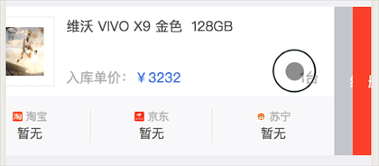

## 微信小程序 侧滑删除、编辑

## 前言




目前这个插件并不完美，将就够用。

侧滑交互抄的是微信消息列表，左滑一丢丢并不会展开，大概 `10px` 才会展开。

内部有一个属性记录滑动的点，在结束滑动的时候，判断当前的方向，以最后两个点作为判断。即使左右滑动到了一半，最后方向往右边滑动，也会关闭。

小问题一，默认删除会一直存在，编辑按钮可能不存在。若需要编辑存在，删除不存在，小小的改一下代码可以实现。

小问题二，暂时没有找打一个方法获取元素的宽，所以按钮都是固定 `60px`。

小问题三，删除一个数据，并不是像其他框架那样，直接把某块删了，而是数据删了，当前元素状态保存。所以，点击删除、编辑，等元素状态回到最初才出发事件。如果不这样，点击后的效果是，当前删除、编辑按钮还在，但当前内容已经变成了下一个了。

## 使用方式

正常的引入自定义组件。

```json
{
	"usingComponents": {
		"sideslip-delete": "../components/sideslip-delete/dsideslip-delete"
	}
}
```

```html
<sideslip-delete id="{{一个标识}}" del edit binddel="{{doDel}}" bindedit="{{doEdit}}">
	<view>你的元素</view>
</sideslip-delete>

<!-- 只有删除 -->
<sideslip-delete id="{{一个标识}}" del binddel="{{doDel}}">
	<view>你的元素</view>
</sideslip-delete>
```


```javascript
Page({
	doDel(e) {
		// 点击删除
		console.log(e.target.id); // 传入的标识
	},
	doEdit(e) {
		// 点击编辑
		console.log(e.target.id); // 传入的标识
	}
})
```

## wepy 中使用

```html
<sideslip-delete id="{{一个标识}}" del edit @del="{{doDel}}" @edit="{{doEdit}}">
	<view>你的元素</view>
</sideslip-delete>

<!-- 只有删除 -->
<sideslip-delete id="{{一个标识}}" del @del="{{doDel}}">
	<view>你的元素</view>
</sideslip-delete>
```

```javascript
import wepy from 'wepy';
export default class Index extends wepy.page {
	config = {
        usingComponents: {
            'sideslip-delete': '../components/sideslip-delete/sideslip-delete'
        }
    };
    methods = {
    	doDel(e) {
		// 点击删除
			console.log(e.target.id); // 传入的标识
		},
		doEdit(e) {
			// 点击编辑
			console.log(e.target.id); // 传入的标识
		}
    };
}
```

就是这样，喵~